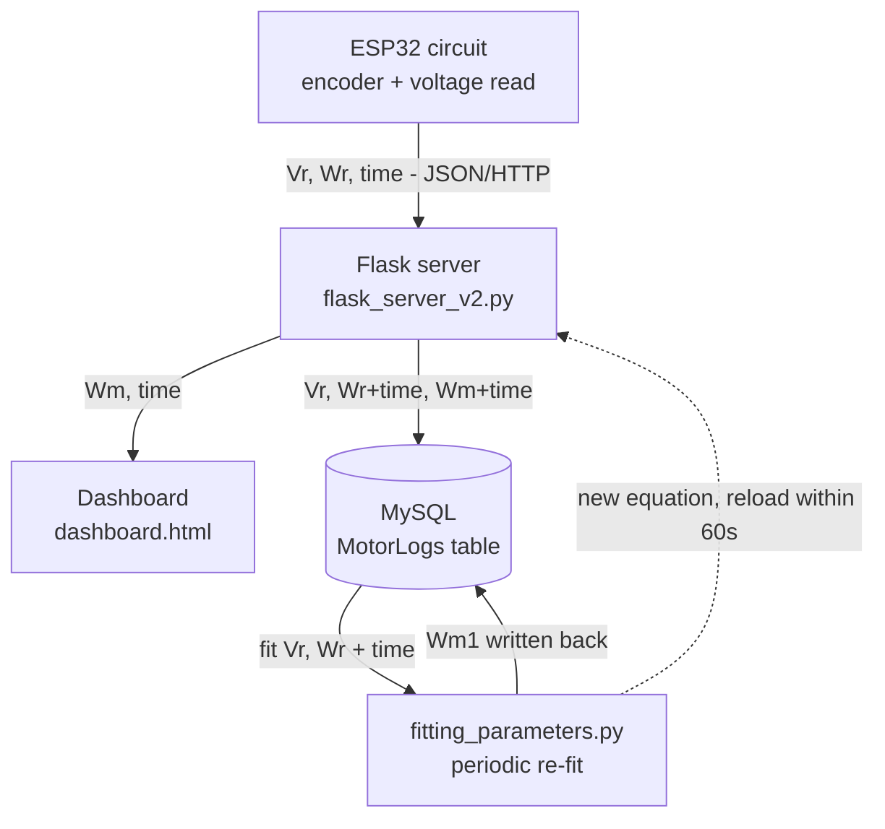

# Conveyor Motor Digital Twin — Project README

## What this project is

A digital twin system for a JGB37-520 conveyor motor: a data-driven
equation predicts the motor's speed, and this prediction is compared in
real time against the real measured speed. When they diverge beyond a
threshold, that's flagged as a potential anomaly (friction, load
change, developing fault) making it the basis for predictive maintenance. Part
of an Industry 4.0 / CDTA project.

## Architecture overview



## Repo structure

```
.
├── ESP32_code.cpp              # firmware: reads encoder+voltage, sends Vr/Wr/time
├── dataset/
│   └── final_combined_dataset.csv   # cleaned historical training data
├── datasheets/                 # motor datasheet
├── labview_files/               # early LabVIEW model exploration
├── model_in_python/
│   ├── fitting_parameters.py   # fits the Wm equation from MySQL history
│   ├── flask_server_v2.py      # live server: receives telemetry, computes Wm, serves dashboard
│   ├── model_with_checking.py  # (in active use -- validation/checking variant)
│   ├── Model_with_PySindy.py   # (in active use -- PySINDy-based exploration)
│   └── templates/
│       └── dashboard.html      # live Wr vs Wm chart
├── pics/                        # hardware photos
├── scripts/
│   └── generate_synthetic_data.py
└── virtualData.sql              # current MySQL schema/data dump
```

## The equation

`fitting_parameters.py` fits a direct algebraic equation (not a
differential equation) using normalized inputs:

```
Vn = Vr / 12.0
Wn = Wr / 60.0
Wm_norm = a*Wn*Vn + (b/2)*Vn*Wn^2 + (c/2)*Wn*Vn^2 + (d/4)*Wn^2*Vn^2 + g
Wm = Wm_norm * 60.0
```

Fit via `lmfit` (nonlinear least squares) with physical bound penalties
during fitting (speed can't exceed rated speed or go negative).
Coefficients are saved to `wm_equation_coeffs.json` (generated locally,
not tracked in git), which `flask_server_v2.py` reads and reloads
automatically within 60 seconds of any update.

**Known limitation, stated plainly**: this equation uses both `Vr` and
`Wr` (the real measured speed) as inputs to compute `Wm`. This means
`Wm` is not fully independent of the value it's being compared
against,worth treating this as closer to a calibrated
smoothing/estimation model than a fully independent virtual twin. See
the report's Discussion/Limitations section for the full reasoning.

## MySQL schema (`MotorLogs` table)

| Column | Type | Notes |
|---|---|---|
| `id` | int, auto-increment | primary key |
| `Vr` | double | real applied voltage |
| `Wr` | double | real measured speed |
| `time_r` | bigint | timestamp of the real reading |
| `Wm` | double, nullable | model-predicted speed |
| `time_m` | bigint, nullable | timestamp Wm was computed |
| `deviation` | double, nullable | `abs(Wr - Wm)` |
| `created_at` | timestamp | auto-set on insert |

## Scripts

### `ESP32_code.cpp`
Reads the encoder (speed, `Wr`) and an analog voltage reading (`Vr`),
sends both plus a timestamp as JSON over HTTP to the Flask server's
`/telemetry` endpoint. Tested via Wokwi simulation (virtual
potentiometer for voltage, virtual rotary encoder for speed pulses),
tunneled to a local Flask server via `cloudflared` since Wokwi runs in
the cloud and can't reach `localhost` directly.

### `flask_server_v2.py`
Receives telemetry, computes `Wm` from the cached equation
coefficients, saves every reading to MySQL, keeps a short in-memory
buffer for fast dashboard polling, and serves the dashboard page.

### `fitting_parameters.py`
Pulls all historical `(Vr, Wr)` data from MySQL, fits the equation
above via `lmfit`, writes the fitted `Wm` back into historical rows,
and saves the fitted coefficients to `wm_equation_coeffs.json` for the
live server to pick up. Meant to be re-run periodically (not
continuously) as more real data accumulates.

### `templates/dashboard.html`
Live-updating chart (polls every 500ms) showing real speed (`Wr`) vs
model speed (`Wm`), with a status badge that flags "ANOMALY" when the
deviation crosses a threshold.

## Setup

```bash
pip install flask mysql-connector-python lmfit scipy numpy matplotlib

# Live dashboard server:
cd model_in_python
python3 flask_server_v2.py
# open http://127.0.0.1:5000/

# Re-fit the equation from accumulated MySQL data:
python3 fitting_parameters.py
```

## Current status

- Full pipeline built and verified at the code level-
- Report in progress, including honest documentation of known limitations ( public-dataset-vs-own-hardware distinction from earlier project stages)
