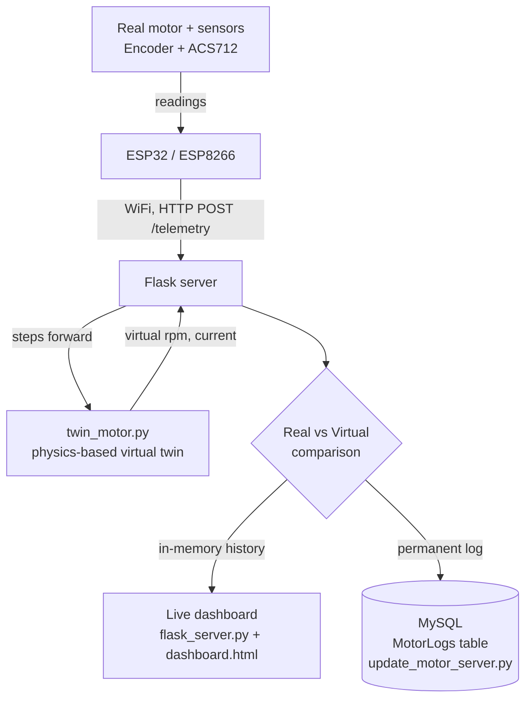

# Conveyor Motor Digital Twin — Project README

## What this project is

A digital twin system for a JGB37-520 conveyor motor: a physics-based
model runs alongside the real motor, and the two are compared in real
time. When they diverge beyond a threshold, that's flagged as a
potential anomaly (friction increase, stall, load change) — the basis
for predictive maintenance. Part of an Industry 4.0 / CDTA project.

## Architecture overview



Two servers exist **on purpose, kept separate**:
- `flask_server.py` — quick live viewing, in-memory only, resets on restart
- `update_motor_server.py` — permanent archival logging to MySQL

## Scripts

### `twin_motor.py` — the physics-based digital twin
Core model of the project. Simulates a healthy motor's electrical and
mechanical behavior using measured constants from a real block test on
our own hardware (R, Kt, Ke, J, B, Tf; gearbox ratio 168:1 confirmed).
Auto-adjusts its internal integration step size based on the electrical
time constant (`L/R`) so it stays numerically stable regardless of the
`dt` it's called with.

**Note:** `L` (inductance) is a critical-damping estimate, not a direct
measurement — flag this if asked in the report/defense.

### `flask_server.py` — live dashboard server
Receives telemetry via `POST /telemetry`, steps `twin_motor.py` forward
using real elapsed time, keeps the last 500 readings in memory, and
serves the dashboard page. Also supports an optional `t_sample` field
(ESP32's own clock, ms since boot) for network-jitter-free
synchronization — falls back to server-arrival-time if not provided.

### `templates/dashboard.html` — the live view
Chart.js-based page, polls the server every 500ms, shows Real vs Virtual
RPM/Current plus a Nominal/Anomaly status badge. Must stay inside a
folder literally named `templates/`, next to `flask_server.py`.

### `update_motor_server.py` — permanent MySQL archive
Separate server (`GET /update-motor`), logs every reading into the
`MotorLogs` table matching the real schema (`Real_speed, Current,
Voltage, Model_speed, Real_torque, Time`). Derives `Real_torque` as
`Kt × Current` since torque isn't measured directly. Opens a fresh DB
connection per request (avoids stale-connection timeouts).

**Setup:** requires `DB_PASSWORD` env var set before running.

### `test_feed.py` — synthetic data generator
Simulates realistic ESP32 telemetry, including a fake load/friction
event partway through, so the whole pipeline (including anomaly
detection) can be tested without real hardware.

### `dataset_loader.py` — public reference dataset reader
Loads `.xlsx` trial files (multiple sheets/trials per file — use
`list_sheets()` to see what's available). Converts units per the
dataset's own documentation (time in microseconds, `Velocity` already in
RPM, `MotorVoltage` as the effective driving voltage).

**Important:** this public dataset is from a different motor (17:1
gearbox ratio) than our own hardware (168:1). Useful for building and
testing the ML pipeline, **not** a substitute for real data from our own
motor.

### `train_model_a.py` — data-driven model (scikit-learn)
Predicts current + rpm from a windowed history of recent voltage
readings. Torque is intentionally excluded (no trustworthy label
available from the public dataset). Time-ordered train/test split to
avoid data leakage.

### `pysindy_fit.py` — automatic equation discovery
Uses PySINDy to discover governing differential equations directly from
recorded data (current, rpm as state; voltage as control input), instead
of hand-deriving them. Data is normalized before fitting — required for
a usable fit. Reports an R² score to judge fit quality.

## Current status

**Done:**
- Physics twin calibrated and validated against real block-test
  measurements
- Live dashboard + permanent archive both working, tested end-to-end
- Anomaly detection confirmed working (tested via synthetic load event)
- Dataset loader working against the real `.xlsx` format
- Both ML approaches (Model A, PySINDy) built and functional

**Known limitations — important to state honestly in the report:**
- Model A and PySINDy are currently trained on a public reference
  dataset (different motor, different gearbox ratio) as a methodology
  demonstration — they do not represent our specific JGB37-520 as-is.
- `L` (inductance) in `twin_motor.py` is a formula-based estimate, not a
  direct measurement.
- ESP32 firmware still needs to send its own timestamp (`t_sample`) for
  the synchronization feature to activate — server-side support is
  already built and tested.

**Plan to fix the "different motor" limitation — real data collection + fine-tuning:**
Real sensor data from our own hardware wasn't obtainable through the
usual channel, so instead: a short real-data collection session is
planned directly at CDTA (Wednesday), logging a few minutes of voltage +
speed (+ current if possible) from our own motor, with **varied**
voltage (steps/ramps, not one constant value) so the session is actually
useful for training. That real data will then be used to **fine-tune**
Model A on top of what it already learned from the public dataset —
standard transfer-learning approach: pretrain on the public dataset,
then continue training on the small real dataset, so the model
transitions from "represents a different motor" to "represents ours."

**Not yet done:**
- CDTA data collection session (Wednesday)
- Fine-tuning script for Model A using the newly collected real data
- ESP32 firmware: add `t_sample` to the telemetry payload
- Bench test to characterize ESP32-to-motor sensor latency
- Report writing (intro research, architecture sections)

## Quick start

```bash
pip install flask pandas scikit-learn pysindy joblib mysql-connector-python openpyxl requests

# Live dashboard:
python3 flask_server.py
# open http://127.0.0.1:5000/

# Feed it test data (separate terminal):
python3 test_feed.py

# Permanent MySQL archive:
export DB_PASSWORD=yourpassword
python3 update_motor_server.py

# Train Model A on a real trial file:
python3 train_model_a.py path/to/dataset.xlsx

# Discover equations with PySINDy:
python3 pysindy_fit.py path/to/dataset.xlsx SheetName
```
